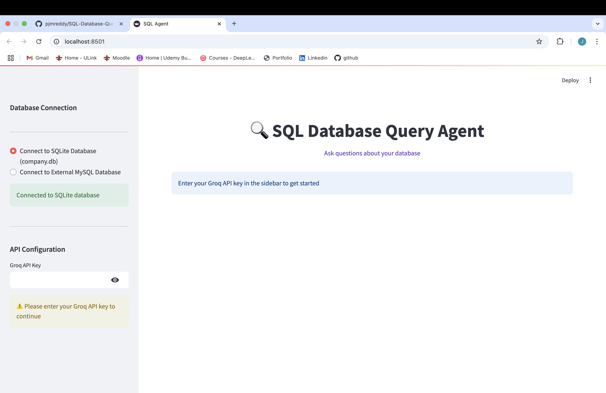
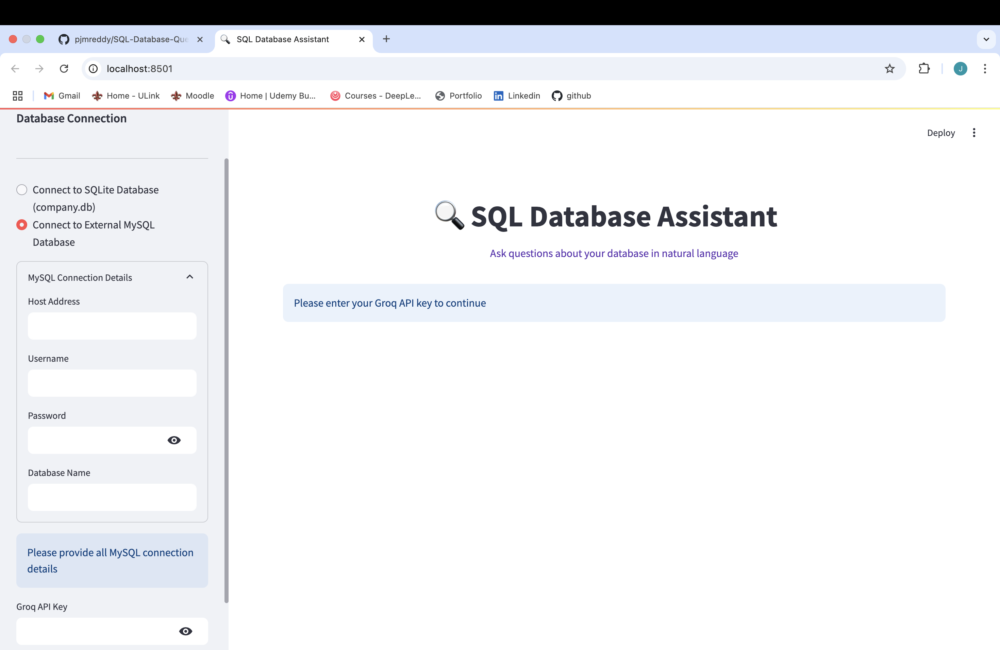
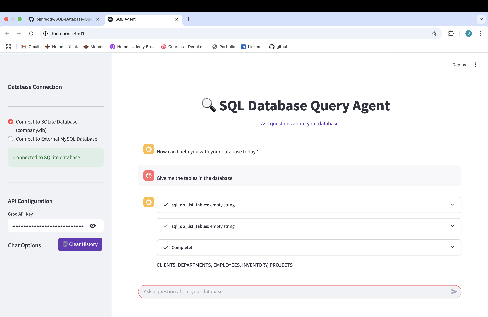

 
# 🔍 SQL Database Query Agent

[](https://sql-database-query-agent.streamlit.app/)

✨ A powerful SQL query Agent that transforms natural language into SQL queries using LangChain and Groq's LLM. Interact with your databases conversationally!




## 🚀 Key Features

- 💾 Connect to SQLite or MySQL databases effortlessly
- 💬 Query databases using natural language - no SQL knowledge required!
- 🎨 Interactive chat interface with streaming responses
- 📝 Persistent chat history for continuous conversations
- ⚡ Real-time results with Groq's ultra-fast LLM
- 🔄 Supports both local and remote database connections  

## Project Structure

- `app.py`: Main application file
- `db_utils.py`: Database connection utilities
- `company_db_init.py`: Database initialization script
- `requirements.txt`: Project dependencies

## Live Demo

[](https://sql-database-query-agent.streamlit.app/)

## ⚙️ Setup & Installation

1️⃣ Install dependencies:
```bash
pip install -r requirements.txt
```

2️⃣ Run the application:
```bash
streamlit run app.py
```


## 🎮 How to Use

1️⃣ Select database type (SQLite/MySQL)
2️⃣ For MySQL, enter connection details
3️⃣ Provide your Groq API key
4️⃣ Start chatting with your database!


## 📋 Requirements

- 🐍 Python 3.8+
- 🔑 Groq API key (free tier available)
- 🗃️ MySQL server (optional for SQLite users)

 - Shows the initial interface where users select their database type (SQLite or MySQL) and enter their Groq API key.

 - Displays the MySQL connection configuration screen where users can input host, port, username, password, and database name.

 - Demonstrates the query results interface showing both the generated SQL query and the natural language response from Groq's LLM.

## 💡 Example Queries

- "Show me all employees in the Marketing department"
- "What's the average salary by department?"
- "Who earns the most in the company?"
- "List projects with budgets over $50k"
- "Which departments are understaffed?"
- "Find employees who joined in the last 6 months"

## License

MIT
