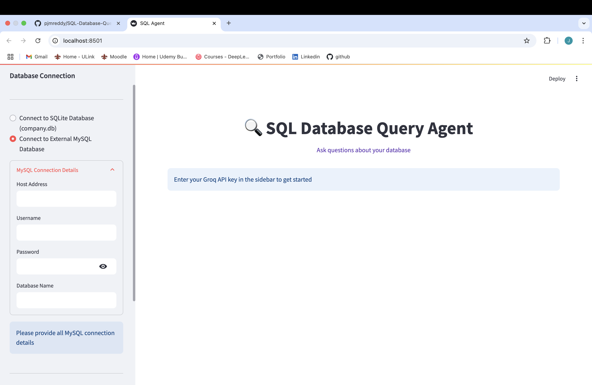

# SQL Database Assistant

A Streamlit application that allows users to interact with SQL databases using natural language queries. This application leverages LangChain and Groq's LLM to translate natural language into SQL queries and provide responses.

## Features

- Connect to SQLite or MySQL databases
- Query databases using natural language
- Interactive chat interface
- Persistent chat history
- Real-time streaming responses

## Project Structure

- `app.py`: Main application file
- `db_utils.py`: Database connection utilities
- `company_db_init.py`: Database initialization script
- `requirements.txt`: Project dependencies

## Setup Instructions

1. Install the required dependencies:
   ```
   pip install -r requirements.txt
   ```

2. Initialize the SQLite database (optional if you want to use the included sample database):
   ```
   python company_db_init.py
   ```

3. Run the Streamlit application:
   ```
   streamlit run app.py
   ```


## Usage

1. Select your database connection type (SQLite or MySQL)
2. If using MySQL, provide your connection details
3. Enter your Groq API key
4. Start asking questions about your database in natural language

## Requirements

- Python 3.8+
- Groq API key
- MySQL server (optional)

 - Shows the initial interface where users select their database type (SQLite or MySQL) and enter their Groq API key.

 - Displays the MySQL connection configuration screen where users can input host, port, username, password, and database name.

 - Demonstrates the query results interface showing both the generated SQL query and the natural language response from Groq's LLM.

## Example Queries

- "Show me all employees in the Marketing department"
- "What is the average salary for each department?"
- "Who has the highest salary in the company?"
- "List all projects with a budget above 50000"

## License

MIT